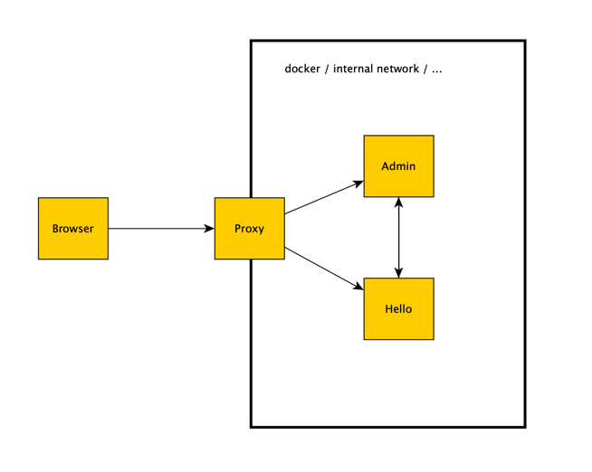

Sample for running behind a reverse proxy.

Proxy is running at `localhost:8888` and different paths lead to different applications:

- http://localhost:8888/hello/ -> calls hello-world app, not be directly reachable
- http://localhost:8888/admin/ -> calls spring-boot-admin app, not be directly reachable



## Prerequisites

- Java
- Maven
- Docker and Docker Compose

## Run Everything
You can run the whole build and start all apps in docker containers with the following script
```bash
chmod u+x buildAndRunAll.sh
./buildAndRunAll.sh
```

## Stop Everything
```bash
docker compose down -v
```